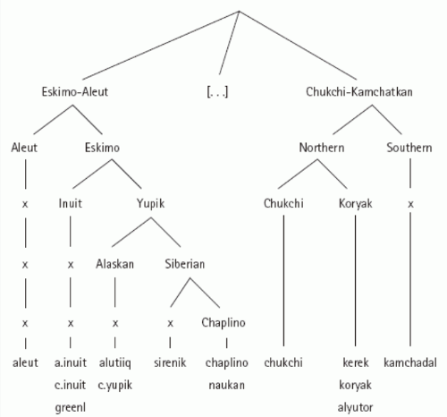
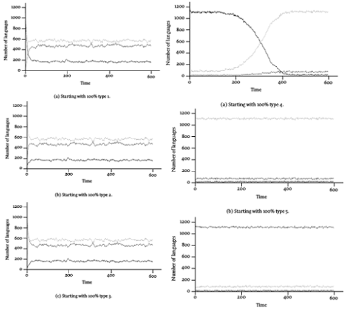

```{r setup, include=FALSE}
options(htmltools.dir.version = FALSE)
knitr::opts_chunk$set(message=FALSE,
                      echo = FALSE,
                      fig.width=10.4,
                      fig.height=5)
library(tidyverse); library(lingtypology); library(dplyr)
db <- read_tsv("https://raw.githubusercontent.com/agricolamz/wcad/master/database.csv")
bibliography <- read_tsv("https://raw.githubusercontent.com/agricolamz/wcad/master/bibliography.csv")

n_alternations <- nrow(db)
n_languages <- length(unique(db$language))
n_contributers <- length(unique(bibliography$contributer))
bibliography$aff <- aff.lang(bibliography$language)
n_affiliation <- unique(sapply(seq_along(bibliography$language), function(i) {
    strsplit(bibliography$aff[i], ",")[[1]][1]}))
n_affiliation <- length(unique(n_affiliation))-1

db %>% 
  filter(language != "Southern Khanty") ->
  db
```

class: inverse, center, middle

# Базы звуковых изменений

---
## Базы звуковых изменений

* [Reduplication database](http://reduplication.uni-graz.at/redup/)
* [Metathesis in language](http://metathesisinlanguage.osu.edu/database.cfm)
* [UniDia Database](http://www.diadm.ish-lyon.cnrs.fr/unidia/index.php)
* [Phonobank](http://glottobank.org/#phonobank)


---
## Теоретические проблемы

* Какие звуковые изменения встречаются часто/редко?
* (и как это объясняют разные фонологические теории?)
* Какие звуковые изменения часто встречаются вместе, а какие не "дружат"?
* Насколько звуковые изменения мотивированы фонологической системой?
* Как универсалии/фриквенталии/рары в области звуковых изменений соотносятся с универсалиями в морфологии, синтаксисе и т. п.?
* Создание data-driven типологии звуквых изменений.
* Какие звуковые изменения встречаются везде, а какие характерны для
  * определенных языковых семей,
  * языковых союзов
  * или макроареалов?
  * ... дискриптивной традиции?
* ... наверное, еще масса всего, о чем я не подумал.

---
class: inverse, center, middle

# World Consonant Alternation Database (WCAD)

<https://agricolamz.github.io/wcad/>

---
## WCAD: общее

В данный момент в базе данных есть

* $`r n_alternations`$ звуковых изменений
* из $`r n_languages`$ языков
* из $`r n_affiliation`$ языковых семей,
* добавленных $`r n_contributers`$ исследователями
  * Ася Дейнекина
  * Аня Бобрёнкова
  * Лёша Виняр
  * Ульяна Багрянская
  * Гарик Мороз

---
## WCAD: основные принципы

* исследователь находит источник
* вносит все звуковые изменения, которые находит
* разбирается в фонологии, чтобы корректно перевести в IPA
* вности комментарии (фонологии vs морфонология)
* добавляет пример
* "разворачивает" сокращения в полях источник и результат
* желательно, чтобы фонологические контексты были не специфичны для языка, поэтому они не "разворачиваются"
* один исследователь вносит **всю языковую (под)группу**

---
class: inverse, center, middle

# Первые результаты

---
## WCAD: количество
```{r}
db %>%
  count(language) ->
  m

map.feature(m$language,
            minichart.data = m$n,
            minichart = "pie",
            minichart.labels = TRUE,
            width = 3,
            label = m$language)
```

---
## WCAD: количество
```{r}
map.feature(m$language,
            feature = m$n,
            title = "# звуковых изм.",
            label = m$language)
```

---
## WCAD: элизия

```{r}
db %>% 
  mutate(elision = grepl("Ø", `→ Y`)) %>% 
  count(language, elision) %>% 
  filter(elision == TRUE) %>% 
  full_join(db[,1]) %>% 
  distinct() %>% 
  mutate(elision = ifelse(is.na(elision), "нет", "есть")) %>%
  mutate(n = ifelse(is.na(n), 0, n)) ->
  elision

map.feature(elision$language,
            feature = elision$elision,
            title = "элизия",
            label = elision$language)
```

---
## WCAD: элизия

```{r}
elision %>% 
  filter(n > 0) ->
  elision
map.feature(elision$language,
            minichart.data = elision$n,
            minichart = "pie",
            minichart.labels = TRUE,
            width = 3,
            label = elision$language)
```

---
## WCAD: вставка

```{r}
db %>% 
  mutate(insertion = grepl("Ø", `X →`)) %>% 
  count(language, insertion) %>% 
  filter(insertion == TRUE) %>% 
  full_join(db[,1]) %>% 
  distinct() %>% 
  mutate(insertion = ifelse(is.na(insertion), "нет", "есть")) %>%
  mutate(n = ifelse(is.na(n), 0, n)) ->
  insertion

map.feature(insertion$language,
            feature = insertion$insertion,
            title = "вставка",
            label = insertion$language)
```

---
## WCAD: вставка

```{r}
insertion %>%
  filter(n > 0) ->
  insertion
map.feature(insertion$language,
            minichart.data = insertion$n,
            minichart = "pie",
            minichart.labels = TRUE,
            width = 3,
            label = insertion$language)
```

---
## WCAD: вставка и элизия

```{r}
colnames(elision)[3] <- "элизия"
colnames(insertion)[3] <- "вставка"
full_join(elision[-2], insertion[-2]) %>% 
  filter(элизия > 0 | вставка > 0) ->
  d

map.feature(d$language,
            minichart.data = d[, 2:3],
            minichart = "bar",
            minichart.labels = TRUE,
            width = 6,
            label = d$language)
```

---
class: inverse, center, middle

# О типологической выборке

---
## О типологической выборке: литература

* Bakker, D. (2010) ‘Language Sampling’, in J. J. Song (ed.), The Oxford Handbook of Linguistic Typology, Oxford Univ. Press.
* Bell, A. (1978). ‘Language Samples‘, in J. H. Greenberg, C. A. Ferguson, and E. A. Moravcsik (eds.), Universals of Human Language. Cambridge, MA: MIT Press, 123–56.
* Dryer, M. S. (1989). ‘Large Linguistic Areas and Language Sampling’, Studies in Language 13: 257–92.
* Janssen, D. P., Bickel, B., and Zúñiga, F. (2006). ‘Randomization Tests in Language Typology’, Linguistic Typology 10: 419–40.
* Maslova E. (2000a). “A dynamic approach to the verification of distribu- tional universals.” Linguistic Typology, vol. 4, no. 3, 307–333.
* Maslova E. (2000b). “Stochastic models in typology: obstacle or prerequisite?” Linguistic Typology, vol. 4, no. 3, 357–364.
* Nichols J. (1992). Linguistic Diversity in Space and Time. Chicago: University of Chicago Press.
* Perkins , R. D. (1989). ‘Statistical Techniques for Determining Language Sample Size’, Studies in Language 13: 293–315.
* Rietveld, T., and van Hout, R. (1993). ‘Statistical Techniques for the Study of Language and Language Behaviour‘. Berlin: Mouton de Gruyter.
* Ritkhoff, J., and Bakker, D. (1998). ‘Language Sampling’, Linguistic Typology 2: 263–314.
* Widmann T. M. (2001) ‘Language Sampling for Typological Studies‘

---
## О типологической выборке: смещения

* генетическое
* контакты
* ? культурное
* типологическое
* библиографическое
* популяционное

---
### Diversity Value technique [Rijkhoff, Bakker 1998]

$$C_k = C_{k-1} + (N_k - N_{k-1}) \times \frac{(MAX - (k-1))}{MAX}$$



---
### Markov chains [Manova 2000], [Widmann 2001]

Переходы из одного типа в другой:

| P(VSO → VSO) | P(SVO → VSO) | P(SOV → VSO) |
|--------------|--------------|--------------|
| P(VSO → SVO) | P(SVO → SVO) | P(SOV → SVO) |
| P(VSO → SOV) | P(SVO → SOV) | P(SOV → SOV) |

Произвольные вероятности из [Widmann 2001]:

| 0.90 | 0.02 | 0.01 |
|------|------|------|
| 0.09 | 0.90 | 0.09 |
| 0.01 | 0.08 | 0.90 |

---
### Markov chains [Widmann 2001]

Type 1: VSO; Type 2: SVO; Type 3: SOV




---
### Мое предложение

* Исследуем все доступные материалы по всем семьям
* Нет выборкам (но если очень нужно их можно делать из всех доступных данных)
* Не обязательно ждать конца исследования, чтобы получить результаты (Байесовское мышление)
* Сравниваем внутригрупповую дисперсию признака с дисперсией по всем группам
  * получаем ответ на вопрос, что редко, что часто
  * получаем "ответ" на вопрос: типологическое  vs. ареальное vs. генеалогическое
* Empirical Bayes and Missing species problem

---
class: middle

* Пишите (<agricolamz@gmail.com>) или открывайте [issue](https://github.com/ropensci/lingtypology/issues).

* Шаблон вебсайта WCAD: <https://ropensci.github.io/lingtypology/>

* Слайды на ресурсе **GitHub**: <https://agricolamz.github.io/2017_WCAD_talk/>

* Презентация сделана при помощи следующих пакетов на R:
  * [**xaringan**](https://github.com/yihui/xaringan)
  * [**lingtypollogy**](https://github.com/ropensci/lingtypology/)
